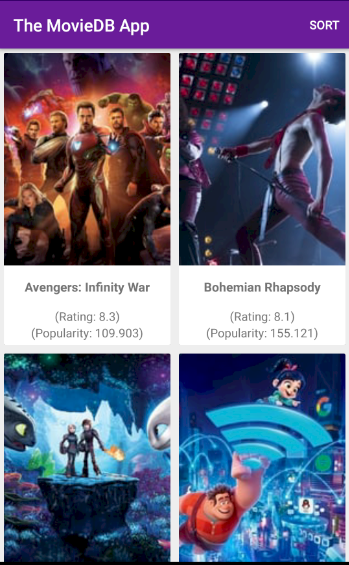
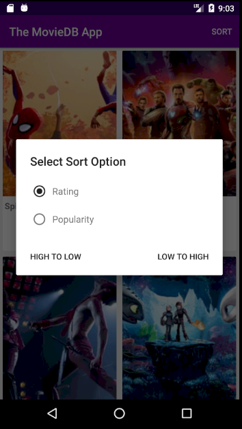
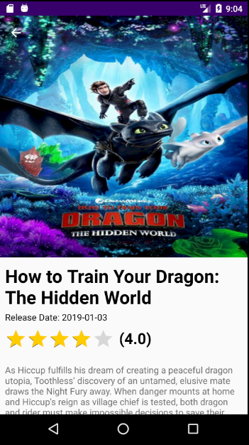
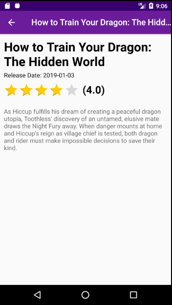

# TheMovieDb App (For Fun & Learning)

A simple app that uses concepts like RxJava, Retrofit, ViewModel, Live Data, Dagger 2, Picasso, Parcel, etc

## Stage 1

#### Main Screen (showing data in a grid View)

#### Main Screen 2 (showing sorting options)

#### Movie Screen (with a collapsible toolbar)

#### Movie Screen 2 (toolbar collapsed state)

